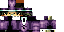

# Stable Diffusion Minecraft Skin Generator

## Overview

The process of fine tuning a Stable Diffusion model to generate Minecraft character previews is detailed here: [Digging into Stable Diffusion-Generated Minecraft Skins](https://monadical.com/posts/mincraft-skin-generation.html).

This codebase further refines that model, and allows for in-game skins to be generated using only a text prompt.  The finetuned model for doing so is available on HuggingFace as [monadical-labs/minecraft-skin-generator](https://huggingface.co/monadical-labs/minecraft-skin-generator).

## Using the Minecraft Skin Generator

1. Check out the minecraft\_skin\_generator GitHub repository onto your computer:

  ```python
  $ git@github.com:Monadical-SAS/minecraft_skin_generator.git
  $ cd minecraft_skin_generator
  ```

1. Install pipenv, if it has not been installed already:

  ```python
  $ pip install pipenv
  ```
  
1. Start up a new pipenv environment and install any dependencies:

  ```python
  $ pipenv shell
  $ pipenv install
  ```

1. Skins can be generated using the minecraft-skins.py script in the bin directory:

  ```python
  $ python bin/minecraft-skins.py output-skin.png "A man in a purple suit wearing a tophat"
  ```

1. The output skin will be saved into the "output-skin.png" file and should be importable directly into Minecraft.

  

## Author

Cory Spencer <cory@monadical.com>