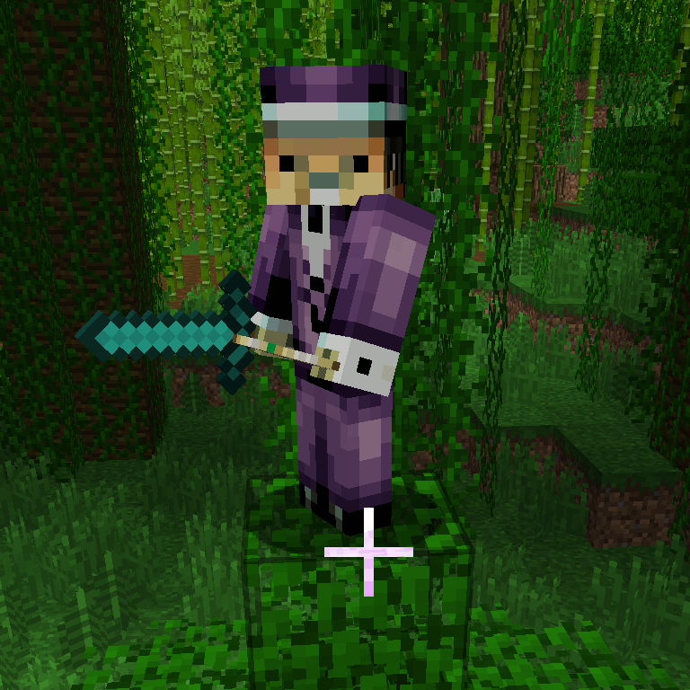

# Stable Diffusion Minecraft Skin Generator


## 💥 Update - February 19th, 2024 💥

We have released a new open sourced Minecraft Skin Generator XL model based on Stable Diffusion XL. It offers many improvements over the original model, including support for the transparency layer.

The new model can be [downloaded from HuggingFace](https://huggingface.co/monadical-labs/minecraft-skin-generator-sdxl).

## Update

We have released a hosted version of our Minecraft Skin Generator at: [https://www.skingenerator.io](https://www.skingenerator.io)

While closed source, this version improves on the quality of generated skins from the publicly available model, plus it supports transparency in the helmet/hair section of the skins.  Please check it out and let us know what you think!

## Overview

The process of fine tuning a Stable Diffusion model to generate Minecraft character previews is detailed here: [Digging into Stable Diffusion-Generated Minecraft Skins](https://monadical.com/posts/mincraft-skin-generation.html).

This codebase further refines that model, and allows for in-game skins to be generated using only a text prompt.  The finetuned model for doing so is available on HuggingFace as [monadical-labs/minecraft-skin-generator](https://huggingface.co/monadical-labs/minecraft-skin-generator).  The model development process is described here in a subsequant blog post: [Even More Skin in the Game: Digging Deeper Into Stable Diffusion-Generated Minecraft Skins](https://monadical.com/posts/minecraft-skins-part2.html).

## Using the Minecraft Skin Generator

1. Clone the minecraft\_skin\_generator GitHub repository onto your computer:

  ```python
  $ git clone git@github.com:Monadical-SAS/minecraft_skin_generator.git
  $ cd minecraft_skin_generator
  ```

2. Install pipenv, if it has not been installed already:

  ```python
  $ pip install pipenv
  ```
  
3. Start up a new pipenv environment and install any dependencies:

  ```python
  $ pipenv shell
  $ pipenv install
  ```

4. Skins can be generated using the minecraft-skins.py script in the bin directory:

  ```python
  $ python bin/minecraft-skins.py output-skin.png "A man in a purple suit wearing a tophat"
  ```

5. The output skin will be saved into "output-skin.png" and should be similar to this:

  
  
6. The skin can then be imported directly into Minecraft:

  


## Author

Cory Spencer <cory@monadical.com>
